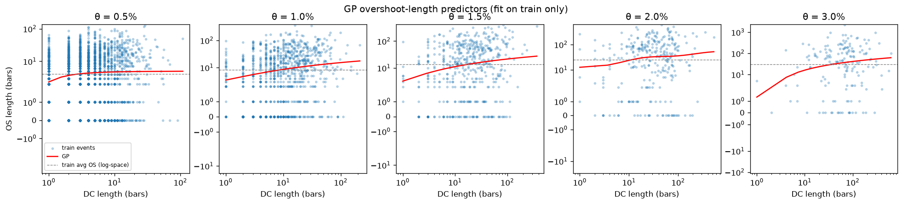
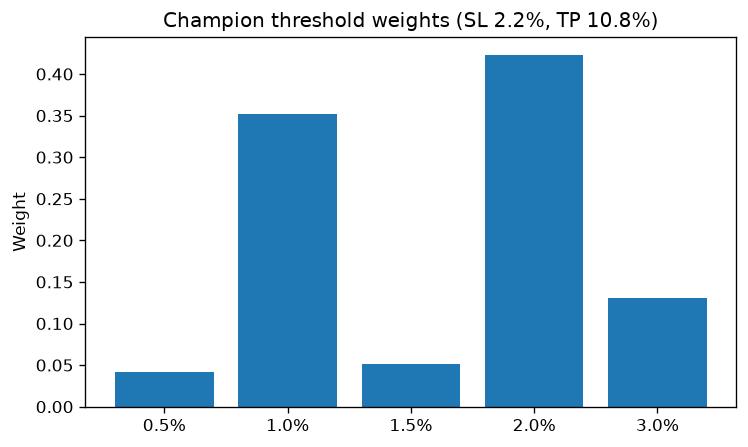
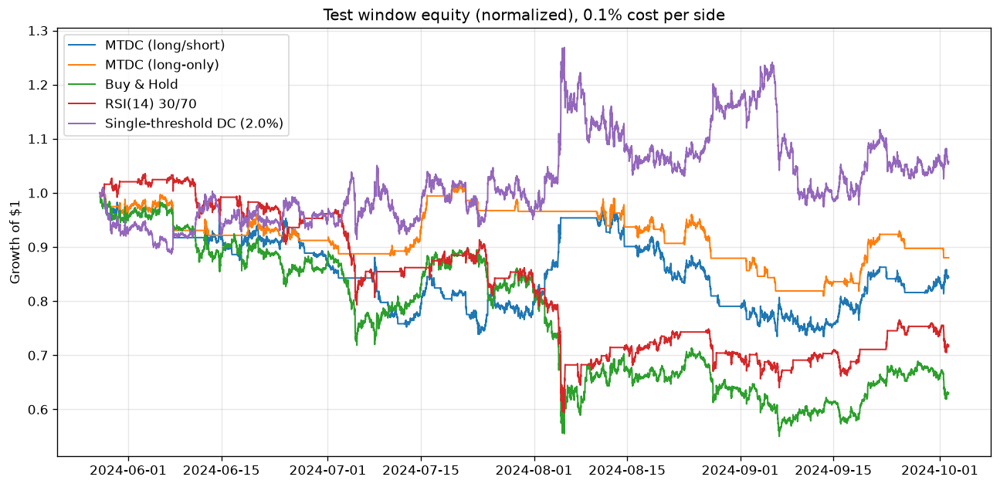
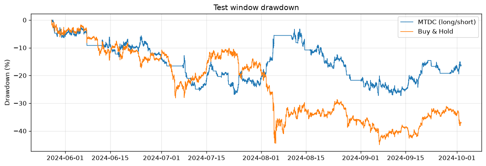
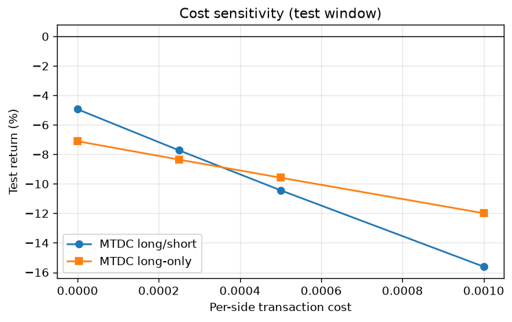
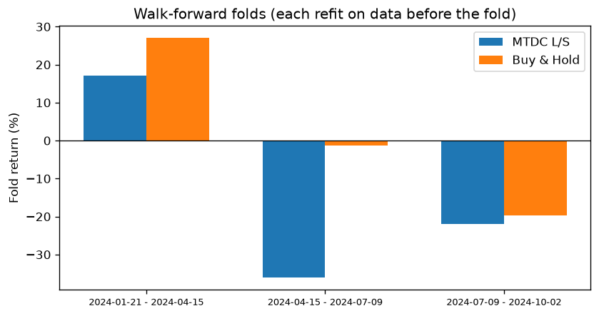

# MTDC Strategy Backtest Results

Generated by `python run_backtest.py --seed 42` (deterministic given the seed).

## Setup

- Data: ETH/USDT 15-minute bars, 2023-01-01 00:00:00 to 2024-10-02 07:30:00 (59703 bars)
- Split: train [2023-01-01 - 2024-01-21], validation [2024-01-21 - 2024-05-27], **test [2024-05-27 - 2024-10-02]** (test touched exactly once)
- Headline transaction cost: 0.100% per side (Binance spot taker); execution: decide on bar close, fill at next bar open
- Thresholds: 0.5%, 1.0%, 1.5%, 2.0%, 3.0%; GP pop 200 x 30 gens; GA pop 40 x 30 gens; seed 42

### Methodological repairs vs the design document

1. **Look-ahead bias removed**: DC events act at their *confirmation* bar (when the θ move is observable), not at the extremum bar the document's pseudocode uses. See the appendix for how much fake profit the naive version manufactures.
2. **Target leakage removed**: the original regression predicted OS length from a 'DC length' that *contained* the OS period itself. The honest feature is confirmation-minus-extremum; the honest target is next-extremum-minus-confirmation.
3. **No scaler leakage**: all statistics (GP fit, average OS, signal levels) come from training data only. Signal strengths compare the predicted OS length to the training average in log1p space — OS lengths are heavily right-skewed (median ~9 bars vs mean ~22 at θ=1%), so the raw-space mean rule would never emit a signal.
4. The document's Nemenyi test is replaced by a moving-block bootstrap CI and a Wilcoxon signed-rank test on daily returns (two-strategy comparison).

## GP overshoot predictors (fit on train only)

| Threshold | Train events | Expression (log space) | Train MSE | Mean-baseline MSE | Beats mean? |
|---|---|---|---|---|---|
| 0.5% | 2343 | `sub(cos(div(-0.8005766045160432, x)), -0.8005766045160432)` | 1.483 | 1.497 | yes |
| 1.0% | 919 | `plog(add(x, sub(add(x, add(0.8765362213469041, x)), plog(0.22335553145190024))))` | 2.082 | 2.169 | yes |
| 1.5% | 502 | `plog(div(sub(-0.21500330830653547, x), -0.21500330830653547))` | 2.666 | 2.755 | yes |
| 2.0% | 293 | `plog(div(sub(mul(x, -0.5953635872052006), cos(sin(x))), plog(cos(0.41747961287087576))))` | 3.160 | 3.244 | yes |
| 3.0% | 165 | `plog(sub(x, div(sub(0.8256580320471096, x), -0.08085900164653803)))` | 3.876 | 3.948 | yes |

## GA champion

- Weights: 0.5%: 0.04, 1.0%: 0.35, 1.5%: 0.05, 2.0%: 0.42, 3.0%: 0.13
- Stop-loss 2.2%, take-profit 10.8%
- Fitness (Sharpe - 2 x maxDD): train 1.04, validation 1.53, test -1.44

## Test window results (headline, 0.1% cost per side)

| Strategy | Return | Sharpe | Sortino | Max DD | Trades | Win rate | Profit factor |
|---|---|---|---|---|---|---|---|
| **MTDC (long/short)** | -15.61% | -0.89 | -1.29 | 27.3% | 60 | 25% | 0.78 |
| **MTDC (long-only)** | -11.99% | -1.18 | -1.65 | 20.2% | 27 | 19% | 0.66 |
| Buy & Hold | -36.96% | -1.84 | -2.50 | 45.0% | 1 | 0% | 0.00 |
| RSI(14) 30/70 | -28.16% | -1.67 | -2.20 | 42.6% | 42 | 60% | 0.50 |
| Single-threshold DC (2.0%) | +5.74% | 0.57 | 0.84 | 23.2% | 82 | 37% | 1.06 |

## Statistical significance (test window)

- Annualized Sharpe (MTDC L/S): -0.89, 95% block-bootstrap CI [-4.36, 2.34]
- Mean bar-return difference vs Buy & Hold: 95% CI [-5.69e-05, 1.04e-04] per 15-min bar
- Wilcoxon signed-rank (daily returns vs Buy & Hold): p = 0.319
- Random-timing null (200 rotations of the action series): strategy return beat 44% of null runs (one-sided p = 0.557; null median -9.4%)

## Cost sensitivity (test window)

| Cost per side | MTDC L/S return | MTDC long-only return |
|---|---|---|
| 0.000% | -4.94% | -7.11% |
| 0.025% | -7.73% | -8.35% |
| 0.050% | -10.43% | -9.58% |
| 0.100% | -15.61% | -11.99% |

## Walk-forward robustness (each fold fully refit on prior data only)

| Fold period | MTDC L/S return | Sharpe | Max DD | Trades | Buy & Hold return |
|---|---|---|---|---|---|
| 2024-01-21 - 2024-04-15 | +17.14% | 1.72 | 21.8% | 22 | +27.03% |
| 2024-04-15 - 2024-07-09 | -36.08% | -3.39 | 39.2% | 18 | -1.25% |
| 2024-07-09 - 2024-10-02 | -21.99% | -1.94 | 31.7% | 37 | -19.73% |

## Verdict

Pre-registered criteria — the system is called profitable only if, on the untouched test window at 0.1% per-side costs:

- (a) net return > 0: **FAIL** (-15.61%)
- (b) Sharpe > 0 with 95% bootstrap CI excluding 0: **FAIL** (Sharpe -0.89, CI [-4.36, 2.34])
- (c) positive in at least 2 of 3 walk-forward folds: **FAIL** (1/3 positive)

### NOT PROFITABLE

Beating buy-and-hold is reported separately above: failing to beat a bull-market benchmark does not by itself make a strategy unprofitable, and beating it in one window does not make it a money machine. This is a single asset over a single ~21-month regime; treat any conclusion as conditional on that.

## Appendix: what the look-ahead bug would have reported

Building the signals at the extremum bar (as the design document's pseudocode does) instead of the confirmation bar, with everything else identical:

- Naive look-ahead test return: **+1167.81%** (Sharpe 16.06)
- Honest test return: -15.61% (Sharpe -0.89)

The difference is manufactured by trading on information that does not exist yet at decision time.
